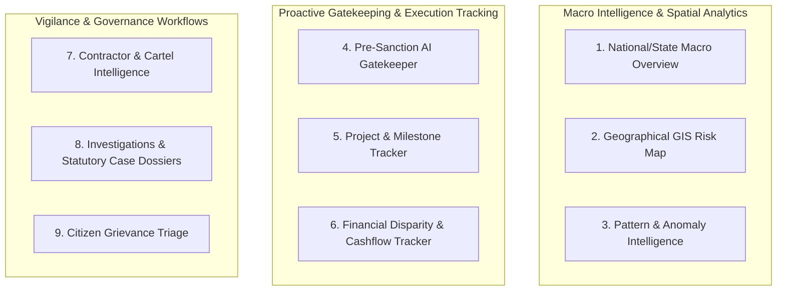
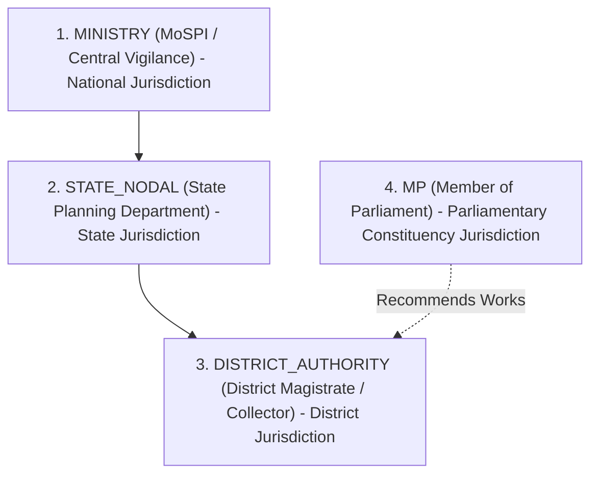
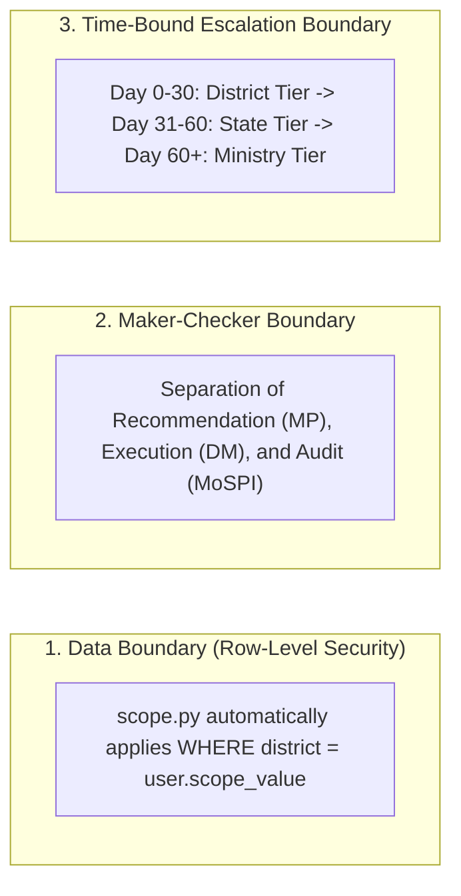

# MPLADS Intelligence Platform: Enterprise Product Architecture & RBAC Specifications

## 1. Executive Summary & Product Vision

The **MPLADS Intelligence Platform** is an enterprise-grade AI decision-support and proactive oversight system designed for the **Ministry of Statistics and Programme Implementation (MoSPI)**, State Nodal Authorities, District Administrations, and Members of Parliament.

Unlike traditional post-facto audit dashboards, this platform acts as an **Active Gatekeeper and Multi-Tiered Governance Operating System** that:
1. **Prevents Fund Leakage at Pre-Sanction:** Blocks non-compliant, duplicate, or inflated project proposals *before* administrative sanction.
2. **Detects Collusion & Cartels:** Identifies contractor cartels, ghost assets, and artificial splitting of tenders.
3. **Automates Statutory Compliance:** Enforces MPLADS 2023 Guidelines, 15% SC / 7.5% ST statutory allocation quotas, and General Financial Rules (GFR 2017).
4. **Generates CVC/CAG Audit-Ready Dossiers:** Synthesizes explainable ML risk factors into legally admissible forensic investigation briefs.

---

## 2. Dashboard Types & Core Modules

The platform is structured into **8 Specialized Functional Views**:

| # | Dashboard Module | Route | Primary Purpose | Key Features |
|---|---|---|---|---|
| **1** | **National & State Overview** | `/dashboard` | Macro executive snapshot | Live fund utilization index, risk band distribution, unspent balance velocity, high-risk contractor network summary. |
| **2** | **Pre-Sanction AI Gatekeeper** | `/dashboard/pre-sanction` | Proactive sanction screener | Keyword-based prohibited items filter (places of worship, private clubs, consumables), 15% SC / 7.5% ST quota checks, 500m proximity duplicate scanner, PWD Schedule of Rates (SoR) cost benchmark. |
| **3** | **Projects & Execution Tracker** | `/dashboard/projects` | Project lifecycle management | Full catalog searchable by risk band, MP name, district, sector, contractor, and data source (Real eSAKSHI vs Synthetic). |
| **4** | **Financials & Milestone Disparity** | `/dashboard/financials` | Anti-fraud cashflow monitoring | Disparity radar tracking projects where financial release ($\%$) heavily outpaces physical progress ($\%$). |
| **5** | **Geographical GIS Map** | `/dashboard/geographic` | Spatial cluster analysis | Interactive MapLibre GL geolocated map with radius queries, state/district boundaries, and risk-coded pins. |
| **6** | **Contractor Intelligence** | `/dashboard/contractors` | Vendor risk & cartel discovery | Contractor risk scores, tender monopolization flags, multi-district project loading, and interactive D3 contractor network graph. |
| **7** | **Pattern & Anomaly Intelligence** | `/dashboard/patterns`, `/dashboard/ml-report` | Explainable AI (XAI) deep-dive | Isolation Forests, Autoencoder reconstruction anomalies, Cluster outliers, and SHAP feature attribution breakdowns. |
| **8** | **Investigations & Case Dossiers** | `/dashboard/investigations` | Enforcement & vigilance workflow | 3-Tier case escalation pipeline, Action Taken Reports (ATR), and 1-click printable CVC/CAG Statutory Forensic Dossier generator. |
| **9** | **Citizen Complaints Triage** | `/dashboard/complaints` | Ground reality & social audit | Geofenced citizen photo complaints, verification status tracking, and SLA resolution tracker. |

---

## 3. Official User Personas (Excluding General Public)

The platform enforces a multi-tier governance model comprising **4 Official Roles**:

### 1. `MINISTRY` (National Super-Administrator / MoSPI & Central Vigilance)
* **Jurisdiction:** Pan-India (All 36 States/UTs, 700+ Districts).
* **Day-to-Day Job:**
  * Macro oversight across states, identifying interstate contractor cartels.
  * National policy calibration and MPLADS Guideline threshold configurations.
  * Final appeal/override authority on escalated high-priority corruption cases.
  * System user provisioning and role administration (`/dashboard/users`).

### 2. `STATE_NODAL` (State Planning Secretary / State Nodal Authority)
* **Jurisdiction:** Single State (e.g., Uttar Pradesh, Maharashtra, Tamil Nadu).
* **Day-to-Day Job:**
  * Monitoring district-wise fund release pace and identifying chronic bottleneck districts.
  * Reviewing cases escalated from the district level after the 30-day resolution SLA.
  * Inter-district contractor monitoring across municipal boundaries.

### 3. `DISTRICT_AUTHORITY` (District Magistrate / Collector / DPO / DDO) — *Primary Operator*
* **Jurisdiction:** Single District (e.g., Varanasi, Pune, Patna).
* **Day-to-Day Job:**
  * **Pre-Sanction Evaluation:** Screening MP recommendations through the AI Gatekeeper before issuing administrative and financial approval.
  * **Execution Monitoring:** Tracking milestone inspections and verifying physical vs financial progress disparity.
  * **Vigilance & Enforcement:** Issuing stop-payment orders, ordering measurement book (MB) audits, and filing Action Taken Reports (ATR).

### 4. `MP` (Member of Parliament — Lok Sabha & Rajya Sabha)
* **Jurisdiction:** Single Parliamentary Constituency.
* **Day-to-Day Job:**
  * Tracking the ground progress and sanction velocity of their recommended works.
  * Identifying stalled projects and understanding reasons for administrative delay.
  * Viewing citizen satisfaction and grievance trends within their constituency.

---

## 4. Role-Based Access Control (RBAC) & Feature Matrix

| Feature / Action | `DISTRICT_AUTHORITY` (DM) | `MP` (Member of Parliament) | `STATE_NODAL` (State Admin) | `MINISTRY` (Central Admin) |
| :--- | :---: | :---: | :---: | :---: |
| **Run Pre-Sanction Clearance** | ✅ **Full Approval / Reject** | 🔍 Simulate & Test Proposals | 👁️ Audit View | ⚙️ Configure Thresholds |
| **Issue Sanction Order / Token** | ✅ **Authorized** | ❌ No (Recommendation only) | ❌ No | ❌ No |
| **Stop-Payment / Freeze Funds** | ✅ **Direct Order** | ❌ Read-only | ⚠️ Recommendation | 🏛️ National Fiscal Freeze |
| **Generate Forensic Dossier** | ✅ Sign & Issue ATR | 🔍 View Case Brief | ✅ State Audit Dossier | ✅ CVC / CAG Submission |
| **Create Investigation** | ✅ District Scope | ⚠️ Flag for Review | ✅ State Scope | ✅ National Direct Audit |
| **Escalate Case (30-Day SLA)** | ✅ Escalate to State | ❌ Read-only | ✅ Escalate to Ministry | 👑 Final Resolution Authority |
| **Contractor Cartel Graph** | 📍 District Contractors | 📍 Constituency Works | 🗺️ State Contractor Networks | 🌐 Pan-India Cartel Graph |
| **Citizen Complaints Triage** | ✅ Verify & Resolve SLA | 👁️ Constituency View | 📊 State SLA Compliance | 📊 National Grievance Index |
| **User & Role Management** | ❌ No Access | ❌ No Access | ❌ No Access | 👑 **Exclusive Access** (`/users`) |

---

## 5. System Boundaries & Security Architecture

To prevent unauthorized access, administrative overreach, and political conflicts of interest, the platform enforces three strict architectural boundaries:

### Boundary 1: Row-Level Data Scoping (RLS)
Implemented at the database query layer ([`backend/app/core/scope.py`](file:///c:/Users/AANANDI/OneDrive/Desktop/sih/mplads-intelligence/backend/app/core/scope.py)):
* Every API query checks the authenticated JWT token's `role` and `scope_value`.
* A **District Magistrate of Varanasi** cannot view or modify cases in **Pune**.
* An **MP of Varanasi Constituency** cannot access project pipelines of adjacent constituencies.
* Only users with the `MINISTRY` role have unscoped, pan-India visibility.

### Boundary 2: Maker-Checker & Conflict of Interest Isolation
* **MP Isolation:** Members of Parliament have full visibility to recommend and track works, but *cannot* approve their own proposals, select contractors, or sign financial disbursement bills (eliminating kickback risks).
* **District Executive Isolation:** The District Magistrate can sanction eligible works and halt payments, but *cannot* alter central guideline definitions or delete immutable audit logs.

### Boundary 3: Tiered Escalation Lifecycle (Time-Bound Accountability)
Investigative cases follow a strict statutory state machine:
$$\text{District Tier (Days 0–30)} \xrightarrow{\text{Overdue / Unresolved}} \text{State Nodal Tier (Days 31–60)} \xrightarrow{\text{Critical Breach}} \text{Ministry / Vigilance (National Tier)}$$
* If a critical anomaly (e.g. 90% money paid with 0% ground progress) is left unresolved by the district authority for more than 30 days, the platform flags `overdue_for_escalation = true` and transfers oversight to the State Nodal Authority.
